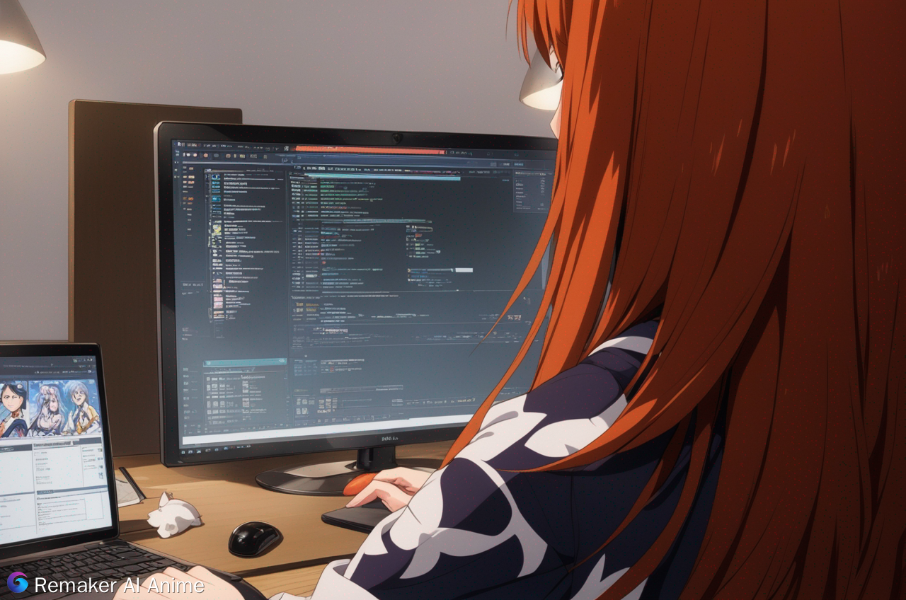

<!-- Profile Header -->
<h1 align="center" class="name">
  <a href="https://github.com/work-24" rel="nofollow">Madhu Dhiman</a>
</h1>

    

<!---->

<!-- Bio Section -->

  <em>I'm a Systems Software Engineer with 4+ years of experience in low-level and performance-critical programming. I specialize in C, C++, and Rust, with a growing interest in distributed systems, cloud infrastructure, and network performance. I’m passionate about writing clean, efficient code whether it's optimizing network stacks, building low-latency backends, or exploring compiler internals.</em>

  

  <pre align="left">
madhu@github
-------------------------
💻 I'm a self-taught C/C++ Developer
📚 I have a Master's in Computer Applications
🧠 I have a strong interest in Data Science and Systems Programming
🌟 Main languages: C, C++, C#, Rust, and Python  
🚀 Exploring low-level programming
🔍 Currently exploring distributed systems
🎵 Love lo-fi and soft music
  </pre>

<!---->

<!-- Contact Links -->

&nbsp;&nbsp;&nbsp;&nbsp;

&nbsp;&nbsp;&nbsp;&nbsp;

<!--div align="center">
  
  &nbsp;&nbsp;&nbsp;&nbsp;
  
  &nbsp;&nbsp;&nbsp;&nbsp;
  
</div-->
<!---->

<!--## 📈 GitHub Stats-->

### 🔧 Core Skills
#### 👨🏽‍💻 Systems

  
  &nbsp;&nbsp;
  

#### 👨‍💻 Languages

  
  &nbsp;&nbsp;
  
  &nbsp;&nbsp;
  
  &nbsp;&nbsp;
  
  &nbsp;&nbsp;
  

#### 💻 Tools

  
  &nbsp;&nbsp;
  
  &nbsp;&nbsp;
  
  &nbsp;&nbsp;
  
  &nbsp;&nbsp;
  
  &nbsp;&nbsp;
  
  &nbsp;&nbsp;
  

<!---->

<!--Current Working section-->
### 🚧 Currently Learning
- Async Rust (Tokio)
- eBPF & kernel-level observability
<!---->

<!--Project section-->
### 📌 Featured Projects
<!-- - ⚙️ [Your Rust Network Optimizer](link) — Wrote a performant Rust-based network benchmarking tool-->
- 🌐 [RemoteControl Tool in C++](https://github.com/honey-9-9/Remote-Access-Trojan) — Built client-server communication over sockets with async event loop
<!-- - 📊 [System Profiler in Rust](link) — CLI tool for monitoring CPU/mem usage with zero-copy I/O-->

<!---->

<!---->
<!--## 🏆 Achievements / Certifications -->
<!---->

  <em><b>Disclaimer: Projects on this profile are for educational purposes only. I am not responsible for any bad uses from anyone ❌✋</b></em>

